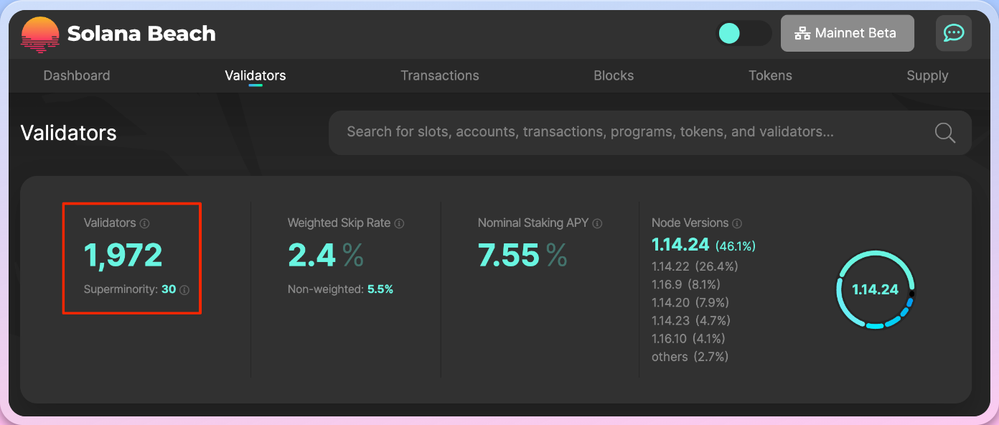

# Homework 2

## 1. How many validators are there currently?

There are [1,972](https://solanabeach.io/validators) validators at the time this written.




## 2. What is special about this [block](https://explorer.solana.com/block/0)?

This is the first block (Genesis) that landed on Solana mainnet.

## 3. What is special about this [address](https://explorer.solana.com/address/1nc1nerator11111111111111111111111111111111)?

[1nc1nerator11111111111111111111111111111111](https://github.com/solana-labs/solana/blob/9e703f85de4184f577f22a1c72a0d33612f2feb1/sdk/program/src/incinerator.rs) is a special program/account address for the Solana burn address.


## 4. What is this [transaction](https://explorer.solana.com/tx/45pGoC4Rr3fJ1TKrsiRkhHRbdUeX7633XAGVec6XzVdpRbzQgHhe6ZC6Uq164MPWtiqMg7wCkC6Wy3jy2BqsDEKf) doing?

This transaction transfer `11,365,066.99` SOL from this account `3o6xgkJ9sTmDeQWyfj3sxwon18fXJB9PV5LDc8sfgR4a` to Solana burn address `1nc1nerator11111111111111111111111111111111`.


## 5. What is the largest balance you can find in an account?

This [account](https://explorer.solana.com/address/9WzDXwBbmkg8ZTbNMqUxvQRAyrZzDsGYdLVL9zYtAWWM) holds `16,028,576.633259244` SOL.

## 6. What advantages will the end user see when using Solana compared to other blockchains ?

The main benefits choosing Solana over other blockchains because of transaction speed and low cost for transaction fees.


## 7. Install Rust in preparation for tomorrow's lesson:

```bash
❯ rustc --version
rustc 1.72.0 (5680fa18f 2023-08-23)
```
