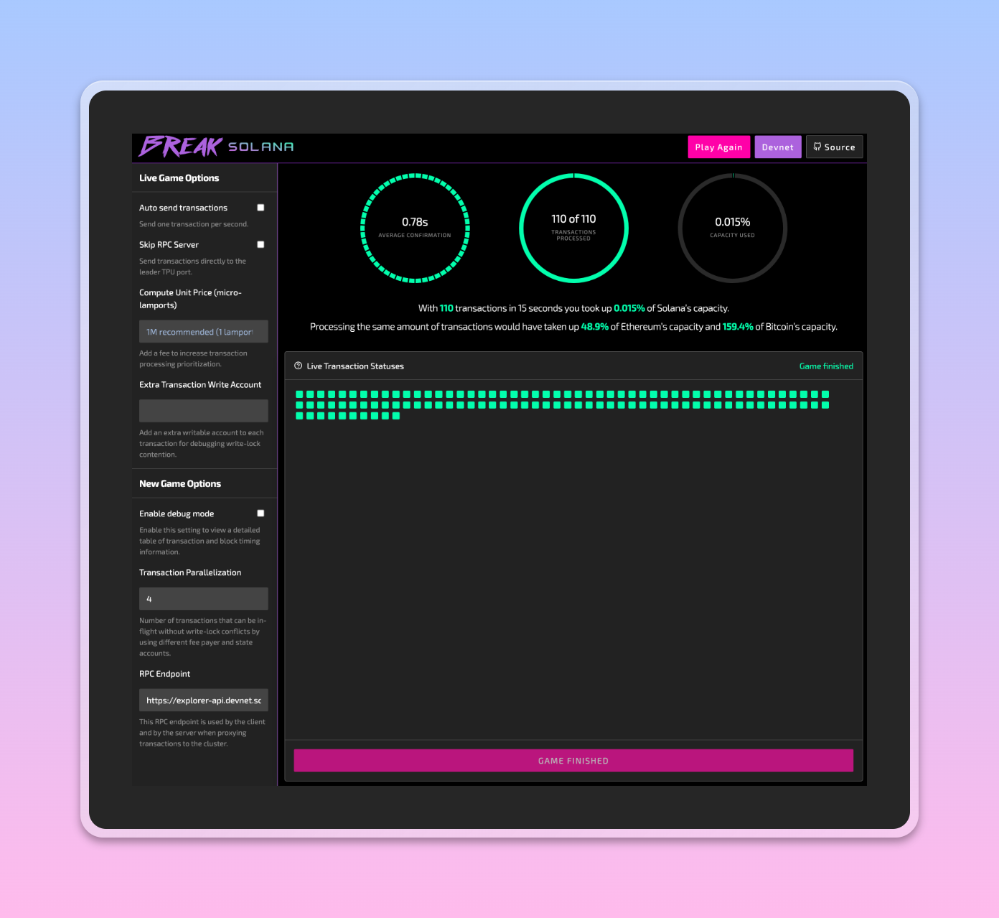

# Homework 4

## Sending lamports

```sh
❯ solana balance CMNHLpRzDxqLY6Sos5YduLniyvS2tQKygwMyrxPjQezL --url https://api.devnet.solana.com
1 SOL

❯ solana balance Dwskyhgwth3f91avtfCyUHgMwhr62QznFZBH3wwrVqxX --url https://api.devnet.solana.com
1.34401848 SOL

❯ solana transfer --from my-keypair.json Dwskyhgwth3f91avtfCyUHgMwhr62QznFZBH3wwrVqxX 0.5 --allow-unfunded-recipient --url https://api.devnet.solana.com --fee-payer my-keypair.json

Signature: 4AjWDYcQJdqxCezptbDYBHXAr55akGAuijQNWvKRWe5jpnr3YHoKycip2LRPVviYByQy8tjdzTKoaEXjgA7gDHur

```

See [transaction](https://explorer.solana.com/tx/4AjWDYcQJdqxCezptbDYBHXAr55akGAuijQNWvKRWe5jpnr3YHoKycip2LRPVviYByQy8tjdzTKoaEXjgA7gDHur?cluster=devnet)

## Break Solana Game



## Fizz buzz program

1. Create a project called bootcamp using Cargo.
2. The main function should print a welcome message.
3. Write a `fizzbuzz` function that will be called from your main function.
    1. The function should have a loop counting up to 301
    2. If the count is divisible by 3, print "fizz"
    3. If the count is divisible by 5 print "buzz"
    4. If the count is divisible by 3 and 5 print "fizz buzz"
    5. At the end print the number of times "fizz buzz" occurred.

### Run Program

<details>
  <summary>Click here to see the program output</summary>

```sh
❯ cargo run
Compiling fizzbuzz v0.1.0 (/Users/user/Playground/solana/encode-autumn-solana-bootcamp-q3-2023/day_04/fizzbuzz)
    Finished dev [unoptimized + debuginfo] target(s) in 0.41s
    Running `target/debug/fizzbuzz`
Welcome to Solana Bootcamp - Homework 4: Fizzbuzz
=================================================
fizz
buzz
fizz
fizz
buzz
fizz
fizz buzz
fizz
buzz
fizz
fizz
buzz
fizz
fizz buzz
fizz
buzz
fizz
fizz
buzz
fizz
fizz buzz
fizz
buzz
fizz
fizz
buzz
fizz
fizz buzz
fizz
buzz
fizz
fizz
buzz
fizz
fizz buzz
fizz
buzz
fizz
fizz
buzz
fizz
fizz buzz
fizz
buzz
fizz
fizz
buzz
fizz
fizz buzz
fizz
buzz
fizz
fizz
buzz
fizz
fizz buzz
fizz
buzz
fizz
fizz
buzz
fizz
fizz buzz
fizz
buzz
fizz
fizz
buzz
fizz
fizz buzz
fizz
buzz
fizz
fizz
buzz
fizz
fizz buzz
fizz
buzz
fizz
fizz
buzz
fizz
fizz buzz
fizz
buzz
fizz
fizz
buzz
fizz
fizz buzz
fizz
buzz
fizz
fizz
buzz
fizz
fizz buzz
fizz
buzz
fizz
fizz
buzz
fizz
fizz buzz
fizz
buzz
fizz
fizz
buzz
fizz
fizz buzz
fizz
buzz
fizz
fizz
buzz
fizz
fizz buzz
fizz
buzz
fizz
fizz
buzz
fizz
fizz buzz
fizz
buzz
fizz
fizz
buzz
fizz
fizz buzz
fizz
buzz
fizz
fizz
buzz
fizz
fizz buzz

There are 20 "fizz buzz" occurred.
```
</details>
