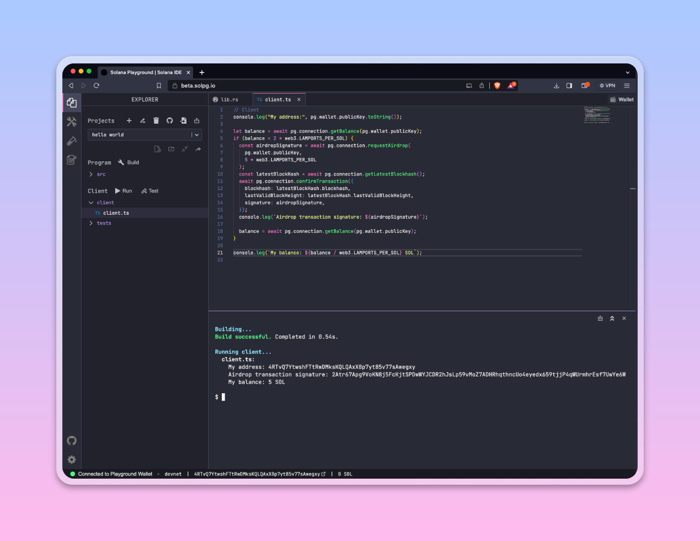

# Homework 10

## Request airdrop from client

[](https://beta.solpg.io/650496a46f50baeacc2cd48e)

```ts
console.log("My address:", pg.wallet.publicKey.toString());

let balance = await pg.connection.getBalance(pg.wallet.publicKey);
if (balance < 2 * web3.LAMPORTS_PER_SOL) {
    const airdropSignature = await pg.connection.requestAirdrop(
        pg.wallet.publicKey,
        5 * web3.LAMPORTS_PER_SOL,
    );
    const latestBlockHash = await pg.connection.getLatestBlockhash();
    await pg.connection.confirmTransaction({
        blockhash: latestBlockHash.blockhash,
        lastValidBlockHeight: latestBlockHash.lastValidBlockHeight,
        signature: airdropSignature,
    });
    console.log(`Airdrop transaction signature: ${airdropSignature}`);

    balance = await pg.connection.getBalance(pg.wallet.publicKey);
}

console.log(`My balance: ${balance / web3.LAMPORTS_PER_SOL} SOL`);
```
