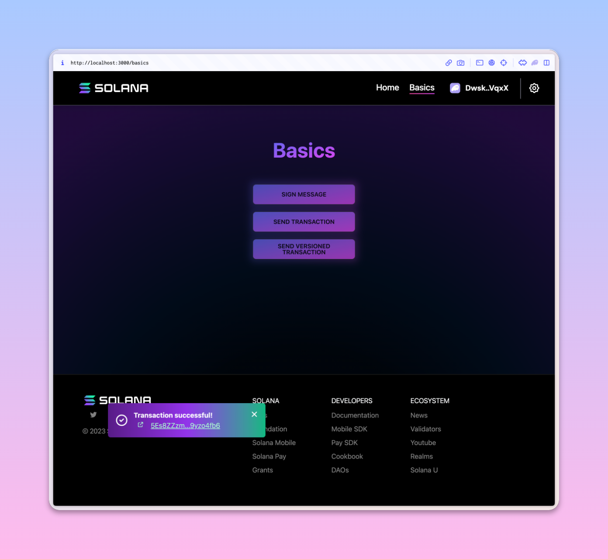
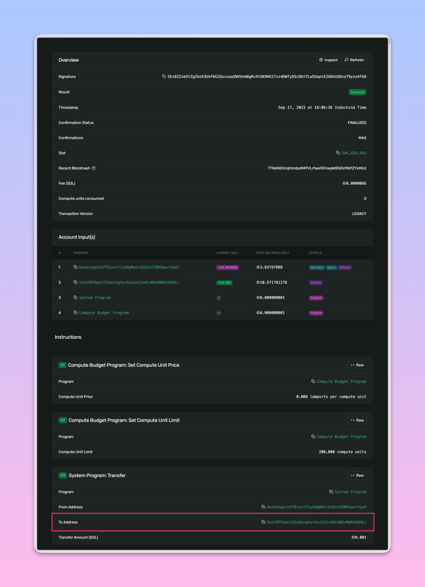

# Homework 11

## Airdrop to my connected wallet (Phantom)

## Send a transaction (transfer) to a particular address

<https://explorer.solana.com/tx/5Es8ZZzm5tZgZkeX3GkF6GJQscuuaZWVUnm8gRvXtGK9HG1Tvs4DWfyDScDbtfLw5UaptXJADUsDDnsT9yzo4fb6?cluster=devnet>

