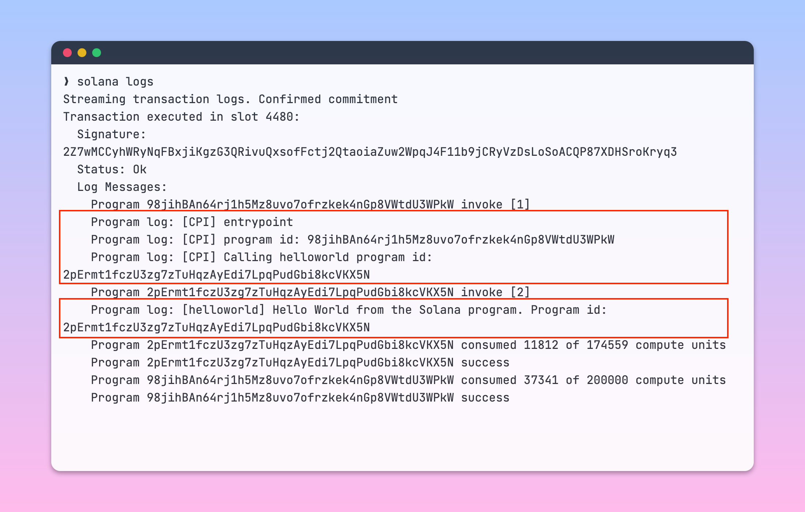

# Example 4: Cross-Program Invocations (CPI)

## Install node dependencies

```bash
❯ npm install

```

## Start local node

```bash
❯ npm run local-node

```

## Build Solana program

```bash
❯ npm run build

```

## Deploy Solana program

```bash
❯ npm run deploy

```

## Run client to interact with Solana program

```bash
❯ npm run client

```

## Output from invoking the program


